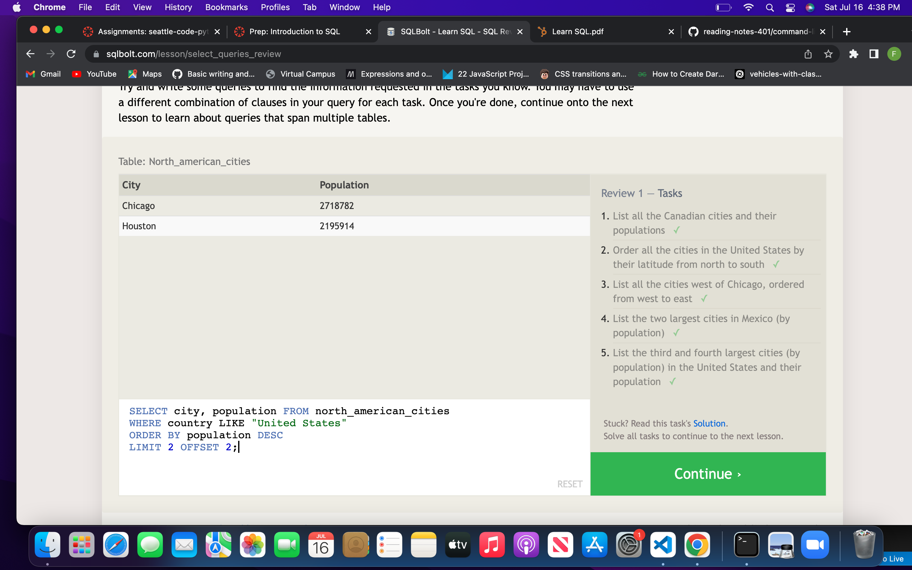

# Introduction to SQL Summary

My understanding of rational databases is that its a type of database that stores data points/information. A typical rational database is a table with columns and rows that consist of data or keys. SQL stands for structured query language. To select specific titles, id's etc you can create a query to find that exact information. Some disadvantages of rational data bases could be structure related. Relational databases require a lot of structure and a level of planning because columns must be defined and data needs to fit correctly into rigid categories.

